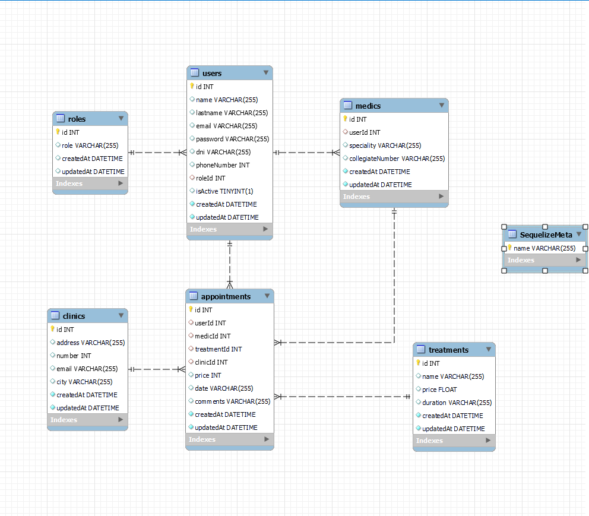

<h1 align="center">CLINICA_DENTAL-BACKEND</h1>

---

<h3>1. Explicación del proyecto
<h3>2. Tecnologías utilizadas
<h3>3. Créditos

---

<h3>1. Explicación del proyecto</h3>

Este proyecto ha sido mi primer proyecto de backend en mi formación como fullstack developer. En este caso he creado un backend de una clínica dental.

El proyecto consistía en realizar desde cero un backend funcional con Node.js, Express, Mysql y Sequelize. Además de Postman para realizar las peticiones HTTP. 

Yo he hecho 6 tablas: 

    Roles, Usuarios, Médicos, Tratamientos, Clínicas y Citas

Este es el esquema de relación entre las tablas: 

<h3>2. Tecnologías utilizadas</h3>

<h3>Créditos</h3>

Gracias a todos mis compañeros y a los profesores por el apoyo y por lo que se implican en los proyectos.

